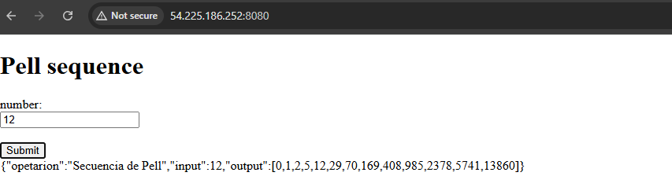

# arep-parcial2

## instalacion

### dependencias

* tener instalado java 17+
* tener instalado mvn

clonar el proyecto
```
git clone https://github.com/JAGBytes/arep-parcial2.git

cd arep-parcial2.git

```

luego de eso dirigirse a mathService
```
cd .\mathService\

```

y ejecutar los siguientes comandos

```
mvn clean install

java -jar target/mathService-0.0.1-SNAPSHOT.jar

```

después, hacer lo mismo con el proxy, de ser necesario cambiar puerto al 8081 en el application.properties

```
cd .\proxyService\

```

y ejecutar los siguientes comandos

```
mvn clean install

java -jar target/proxyService-0.0.1-SNAPSHOT.jar

```

### despliegue

para desplegar se tiene que crear tres instancias ec2 con puertos de seguridad 22 y 8080 y configuramos ips elásticas para evitar problemas con el cambio de ip, luego seguir los siguientes comandos en cada una de las instancias

```
sudo yum update -y
sudo yum install git maven -y
sudo dnf install ajva-17-amazon-correto -y
```

luego se cambiar las rutas del proxy para que apuntes a las ips de las ec2 que tendran el back en la siguiente linea de codigo

```java
    try{
        System.out.println("intento instancia 1");
        res = HttpConnection("http://nueva-ip-back1:8080/pellseq?value="+value);
        
    }catch(Exception e){
        System.out.println("1 no responde");
        System.out.println("intento instancia 2");
        res = HttpConnection("http://nueva-ip-back2:8080/pellseq?value="+value);

    }
```

posteriormente de clona el proyecto en cada una de las instancias y y se inicial en dos un mathService y en otra el proxy como se explico en la parte anterior

## evidencia

A continuación se muestra una petición al mathService1 desplegada en una ec2


luego se hace una petición a la otra instancia para confirmar que funcione


Ahora se prueba el proxy para ver que funcione y que la comunicación entre servicios funciona correctemente


se hacen peticiones con los dos mathService y observamos que hace la consulta al primero


Ahora hacemos que se caiga el primer servidor y hacemos peticiones para ver que si se esta redirigiendo correctamente


## Video
en el repo
<video controls src="images/video.mp4" title="Title"></video>


```
https://pruebacorreoescuelaingeduco-my.sharepoint.com/:v:/g/personal/jorge_gamboa-s_mail_escuelaing_edu_co/EU3BtnP2wKJKgjAKxF56ZsoB1mNv_lkKzA-FuGOLB8cUzQ?e=fx8vwk
```